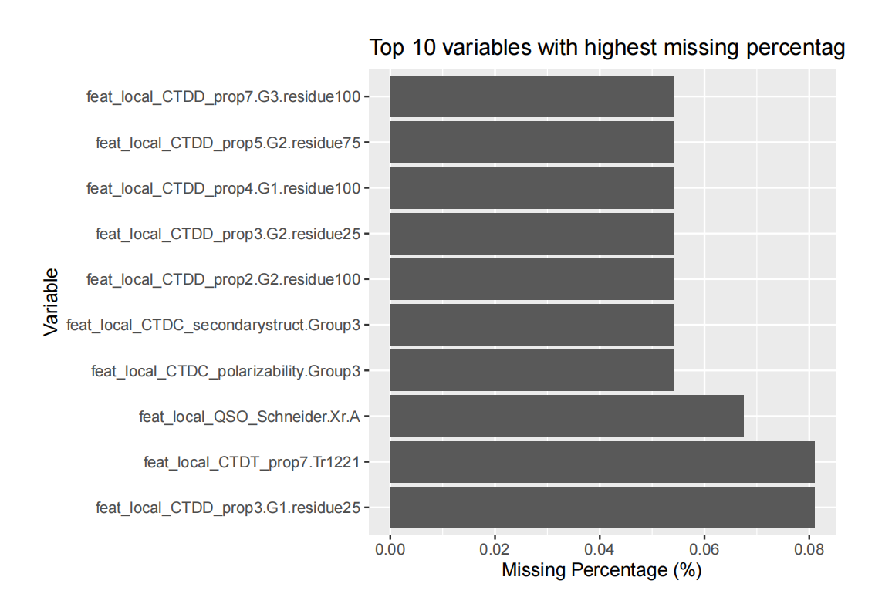
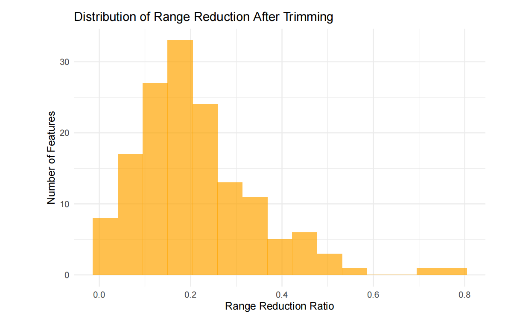
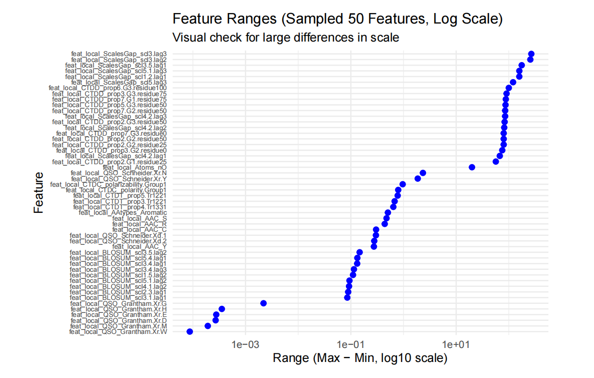

# High-Dimensional Classification Pipeline in R

An end-to-end machine learning project for a high-dimensional grouped classification task, built with R and tidymodels.

---

## Project Overview

This project develops a predictive pipeline for a challenging classification problem with three key characteristics:

* High dimensionality
* Grouped observations
* Missing data and preprocessing requirements

A key modelling constraint is that observations belonging to the same group must remain together during data splitting and cross-validation to prevent data leakage.

The workflow includes:

* Exploratory Data Analysis (EDA)
* Data preprocessing
* Grouped cross-validation
* Baseline modelling
* Model comparison
* Hyperparameter tuning
* Threshold optimisation
* Final holdout prediction

---

## Tech Stack

* R
* tidyverse
* tidymodels
* recipes
* parsnip
* bonsai
* themis

---

## Key Results

* Dataset size: **7,403 observations**, **390 variables**, **385 features**, **550 groups**
* Baseline Logistic Regression CV F1: **0.7281**
* Tuned Random Forest CV F1: **0.7703**
* Improvement over baseline: **+0.0422 F1**

---
## 📊 Example Analysis

### Missing Data Analysis

### Outlier Impact Analysis

### Feature Scale Differences

---

## Key Highlights

* Designed a full machine learning pipeline for **high-dimensional data**
* Implemented **grouped cross-validation** to prevent data leakage
* Performed systematic **model comparison and tuning**
* Applied **threshold optimisation** to improve classification performance

---

## Repository Contents

* `Task02.Rmd` — source analysis and modelling pipeline
* `Task02.pdf` — full report (EDA, modelling, results)
* `mypreds.rds` — final predictions on holdout dataset

---

## Notes

This repository is based on postgraduate coursework and has been refactored as a portfolio project to demonstrate practical skills in:

* High-dimensional data analysis
* Supervised learning
* Model evaluation and optimisation
* Robust validation strategies

---

## Future Improvements

* Feature selection / dimensionality reduction (PCA, LASSO)
* Advanced models (XGBoost, LightGBM)
* Deployment as an API or dashboard
